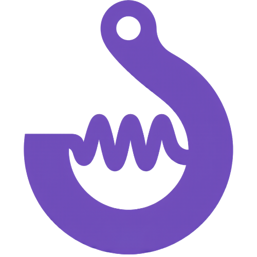

<p align="center">
    
</p>

<p align="center">
    
</p>

<p align="center" style="font-size: 1.2rem; font-weight: bold;">
Modern, unopinionated React hooks with a focus<br/>on developer experience.
</p>

## **Installing**

**Coming soon...**

You can install the package with the following command:
By default, these commands will install all the hooks in the package.

Using `npm`:

```bash
npm install @vibehooks/react
```

Using `pnpm`:

```bash
pnpm add @vibehooks/react
```

But you can also install only the hooks you need with the following command:

Using `npm`:

```bash
npm install @vibehooks/use-toggle
```

Using `pnpm`:

```bash
pnpm add @vibehooks/use-toggle
```

That package is fully typed with TypeScript and comes with all the types you need.
You can use the types just by importing them from the package like this:

```ts
import { useToggle, type UseToggleReturn } from '@vibehooks/use-toggle';
```

## **Contributing**

Contributions are always welcome!

See [`Contributing`](https://github.com/SebastianUrdaneguiBisalaya/vibehooks?tab=contributing-ov-file) for ways to get started.

If you do not want create your custom hook, you can also contribute to the package by mentioning the name and purpose of the hook you would like to see in this package in the [issues](https://github.com/SebastianUrdaneguiBisalaya/vibehooks/issues) section.

## **API Docs**

| **Hook** | **Description** |
| --- | --- |
| [**useAudio**](https://github.com/SebastianUrdaneguiBisalaya/vibehooks/blob/main/src/useAudio.ts) | A React hook providing a declarative and unopinionated interface to manage the HTML5 Audio API lifecycle.|
| [**useAsyncState**](https://github.com/SebastianUrdaneguiBisalaya/vibehooks/blob/main/src/useAsyncState.ts) | |
| [**useAutoScroll**](https://github.com/SebastianUrdaneguiBisalaya/vibehooks/blob/main/src/useAutoScroll.ts) | |
| [**useBarcode**](https://github.com/SebastianUrdaneguiBisalaya/vibehooks/blob/main/src/useBarcode.ts) | |
| [**useBatteryStatus**](https://github.com/SebastianUrdaneguiBisalaya/vibehooks/blob/main/src/useBatteryStatus.ts) | |
| [**useBodyScrollFreeze**](https://github.com/SebastianUrdaneguiBisalaya/vibehooks/blob/main/src/useBodyScrollFreeze.ts) | |
| [**useCookies**](https://github.com/SebastianUrdaneguiBisalaya/vibehooks/blob/main/src/useCookies.ts) | |
| [**useCopyToClipboard**](https://github.com/SebastianUrdaneguiBisalaya/vibehooks/blob/main/src/useCopyToClipboard.ts) | |
| [**useCountDown**](https://github.com/SebastianUrdaneguiBisalaya/vibehooks/blob/main/src/useCountDown.ts) | |
| [**useDebouncedState**](https://github.com/SebastianUrdaneguiBisalaya/vibehooks/blob/main/src/useDebouncedState.ts) | |
| [**useExternalNotifications**](https://github.com/SebastianUrdaneguiBisalaya/vibehooks/blob/main/src/useExternalNotifications.ts) | |
| [**useGeolocation**](https://github.com/SebastianUrdaneguiBisalaya/vibehooks/blob/main/src/useGeolocation.ts) | |
| [**useHoverIntent**](https://github.com/SebastianUrdaneguiBisalaya/vibehooks/blob/main/src/useHoverIntent.ts) | |
| [**useFile**](https://github.com/SebastianUrdaneguiBisalaya/vibehooks/blob/main/src/useFile.ts) | |
| [**useFullscreen**](https://github.com/SebastianUrdaneguiBisalaya/vibehooks/blob/main/src/useFullScreen.ts) | |
| [**useIdle**](https://github.com/SebastianUrdaneguiBisalaya/vibehooks/blob/main/src/useIdle.ts) | |
| [**useIndexedDB**](https://github.com/SebastianUrdaneguiBisalaya/vibehooks/blob/main/src/useIndexedDB.ts) | |
| [**useIntersectionObserver**](https://github.com/SebastianUrdaneguiBisalaya/vibehooks/blob/main/src/useIntersectionObserver.ts) | |
| [**useIntervalSafe**](https://github.com/SebastianUrdaneguiBisalaya/vibehooks/blob/main/src/useIntervalSafe.ts) | |
| [**useIsClient**](https://github.com/SebastianUrdaneguiBisalaya/vibehooks/blob/main/src/useIsClient.ts) | |
| [**useIsDesktop**](https://github.com/SebastianUrdaneguiBisalaya/vibehooks/blob/main/src/useIsDesktop.ts) | |
| [**useIsFirstRender**](https://github.com/SebastianUrdaneguiBisalaya/vibehooks/blob/main/src/useIsFirstRender.ts) | |
| [**useList**](https://github.com/SebastianUrdaneguiBisalaya/vibehooks/blob/main/src/useList.ts) | |
| [**useLocalStorage**](https://github.com/SebastianUrdaneguiBisalaya/vibehooks/blob/main/src/useLocalStorage.ts) | |
| [**useLocalNotifications**](https://github.com/SebastianUrdaneguiBisalaya/vibehooks/blob/main/src/useLocalNotifications.ts) | |
| [**useNetworkInformation**](https://github.com/SebastianUrdaneguiBisalaya/vibehooks/blob/main/src/useNetworkInformation.ts) | |
| [**usePageVisibility**](https://github.com/SebastianUrdaneguiBisalaya/vibehooks/blob/main/src/usePageVisibility.ts) | |
| [**usePermissions**](https://github.com/SebastianUrdaneguiBisalaya/vibehooks/blob/main/src/usePermissions.ts) | |
| [**usePictureInPicture**](https://github.com/SebastianUrdaneguiBisalaya/vibehooks/blob/main/src/usePictureInPicture.ts) | |
| [**usePopover**](https://github.com/SebastianUrdaneguiBisalaya/vibehooks/blob/main/src/usePopover.ts) | |
| [**usePreferredTheme**](https://github.com/SebastianUrdaneguiBisalaya/vibehooks/blob/main/src/usePreferredTheme.ts) | |
| [**usePreferredLanguage**](https://github.com/SebastianUrdaneguiBisalaya/vibehooks/blob/main/src/usePreferredLanguage.ts) | |
| [**usePreviousDistinct**](https://github.com/SebastianUrdaneguiBisalaya/vibehooks/blob/main/src/usePreviousDistinct.ts) | |
| [**useResettableState**](https://github.com/SebastianUrdaneguiBisalaya/vibehooks/blob/main/src/useResettableState.ts) | |
| [**useScreenOrientation**](https://github.com/SebastianUrdaneguiBisalaya/vibehooks/blob/main/src/useScreenOrientation.ts) | |
| [**useScreenSize**](https://github.com/SebastianUrdaneguiBisalaya/vibehooks/blob/main/src/useScreenSize.ts) | |
| [**useScreenWakeLock**](https://github.com/SebastianUrdaneguiBisalaya/vibehooks/blob/main/src/useScreenWakeLock.ts) | |
| [**useServerSentEvent**](https://github.com/SebastianUrdaneguiBisalaya/vibehooks/blob/main/src/useServerSentEvent.ts) | |
| [**useShoppingCart**](https://github.com/SebastianUrdaneguiBisalaya/vibehooks/blob/main/src/useShoppingCart.ts) | |
| [**useSmartVideo**](https://github.com/SebastianUrdaneguiBisalaya/vibehooks/blob/main/src/useSmartVideo.ts) | |
| [**useSpeech**](https://github.com/SebastianUrdaneguiBisalaya/vibehooks/blob/main/src/useSpeech.ts) | |
| [**useSummarizer**](https://github.com/SebastianUrdaneguiBisalaya/vibehooks/blob/main/src/useSummarizer.ts) | |
| [**useTaskQueue**](https://github.com/SebastianUrdaneguiBisalaya/vibehooks/blob/main/src/useTaskQueue.ts) | |
| [**useTimeout**](https://github.com/SebastianUrdaneguiBisalaya/vibehooks/blob/main/src/useTimeout.ts) | |
| [**useThrottledCallback**](https://github.com/SebastianUrdaneguiBisalaya/vibehooks/blob/main/src/useThrottledCallback.ts) | |
| [**useTraceUpdates**](https://github.com/SebastianUrdaneguiBisalaya/vibehooks/blob/main/src/useTraceUpdates.ts) | |
| [**useTranslator**](https://github.com/SebastianUrdaneguiBisalaya/vibehooks/blob/main/src/useTranslator.ts) | |
| [**useToggle**](https://github.com/SebastianUrdaneguiBisalaya/vibehooks/blob/main/src/useToggle.ts) | |
| [**useUserActivation**](https://github.com/SebastianUrdaneguiBisalaya/vibehooks/blob/main/src/useUserActivation.ts) | |
| [**useVibration**](https://github.com/SebastianUrdaneguiBisalaya/vibehooks/blob/main/src/useVibration.ts) | |
| [**useWebsocket**](https://github.com/SebastianUrdaneguiBisalaya/vibehooks/blob/main/src/useWebsocket.ts) | |

## **License**

[MIT](https://github.com/SebastianUrdaneguiBisalaya/vibehooks?tab=MIT-1-ov-file)
